# Medical Imaging & 3D Segmentation

Segmentation and volumetric analysis in [3D Slicer](https://www.slicer.org/) — part of a broader **3D printing & robotics** portfolio.

**[GitHub](https://github.com/Bobarinn/medical-imaging-3d-slicer)** · **[Deploy on Vercel](https://vercel.com/new/clone?repository-url=https://github.com/Bobarinn/medical-imaging-3d-slicer)** · `npm run dev` → http://localhost:3456

---

## Artifact 01 — CT Chest (Bone & Lungs)

**Dataset:** `CTChest` · thresholding, Islands, smoothing → `bone.stl` + `lungs.stl`

| | |
|---|---|
| 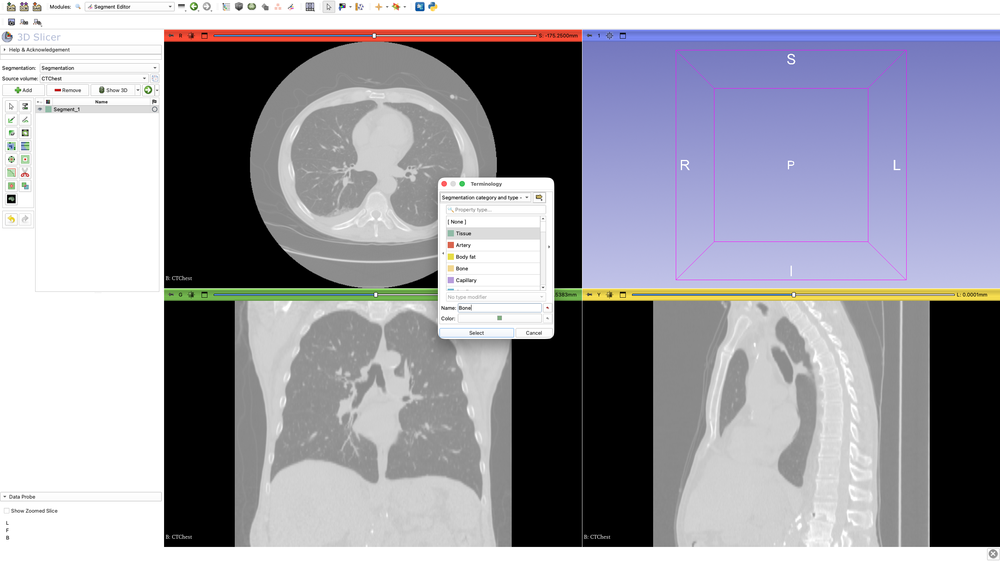 | 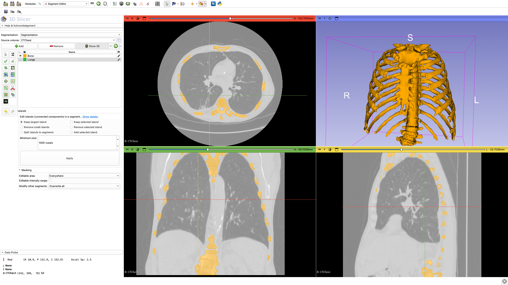 |
| 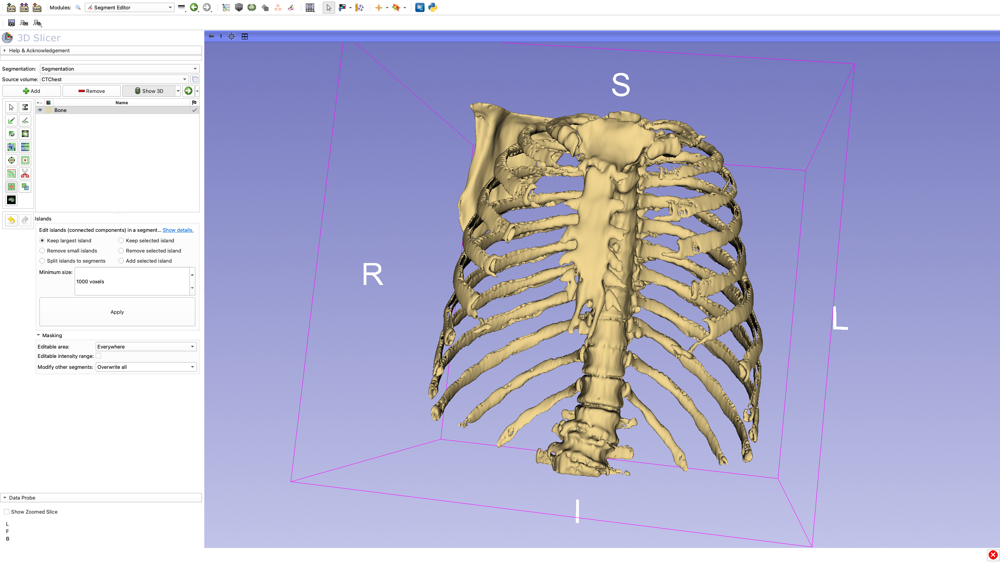 | 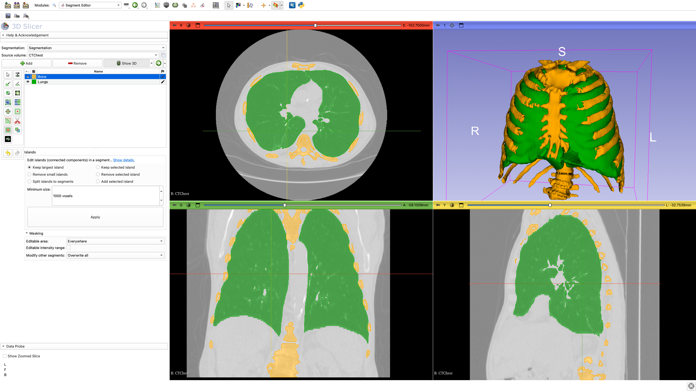 |
| 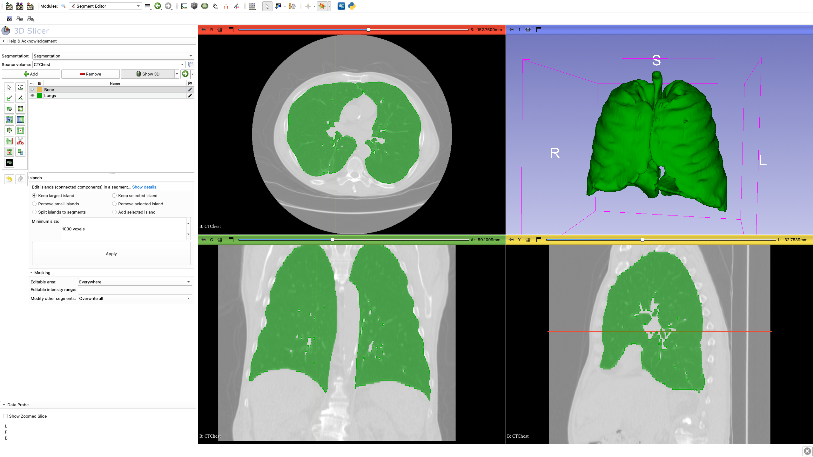 | 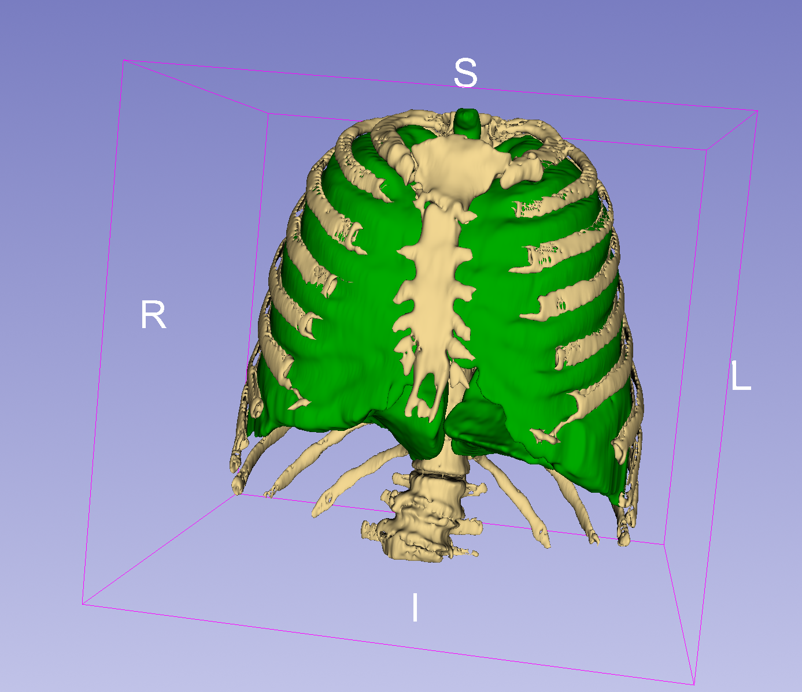 |

---

## Artifact 02 — MR Brain Tumor

**Dataset:** `MRBrainTumor1` · Grow from Seeds, opening + Islands, volume rendering

| | |
|---|---|
| 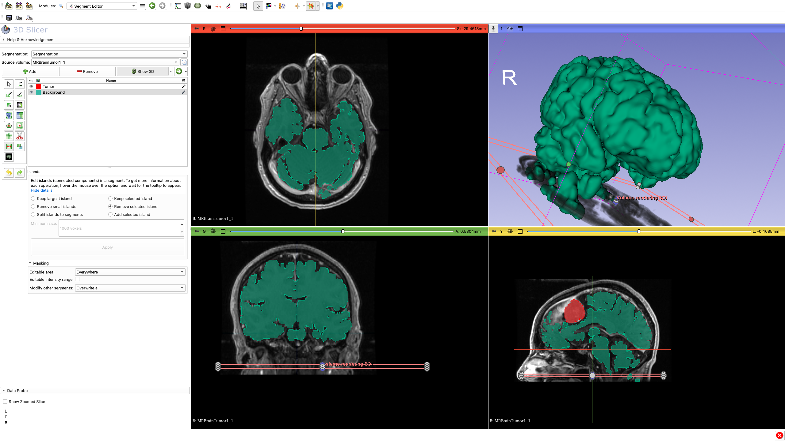 | 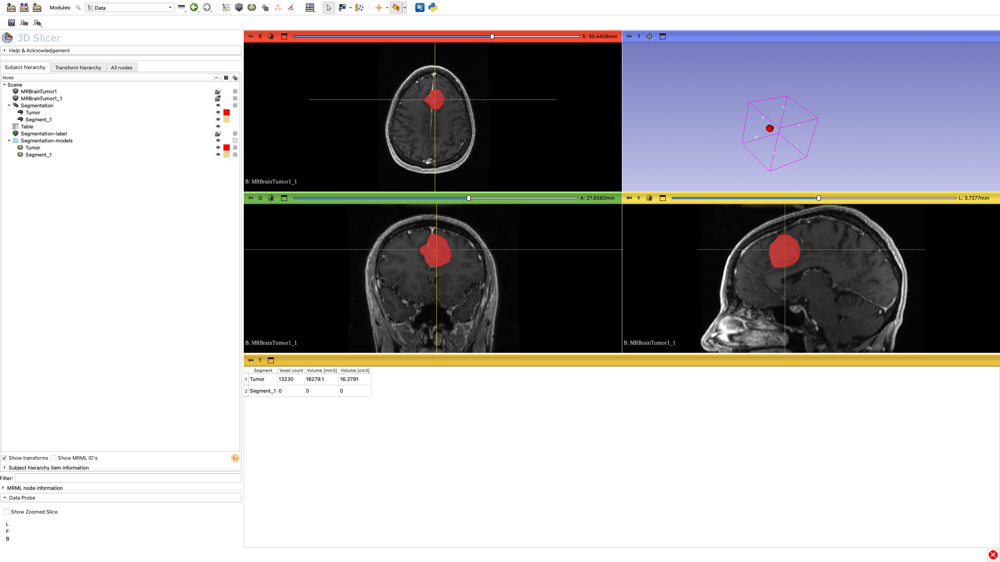 |
| 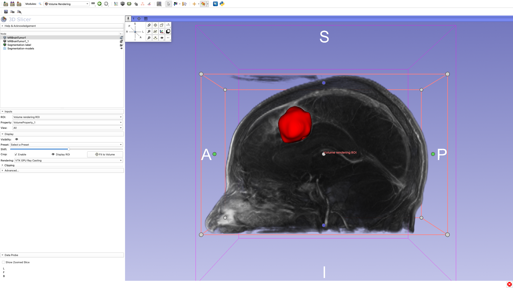 | 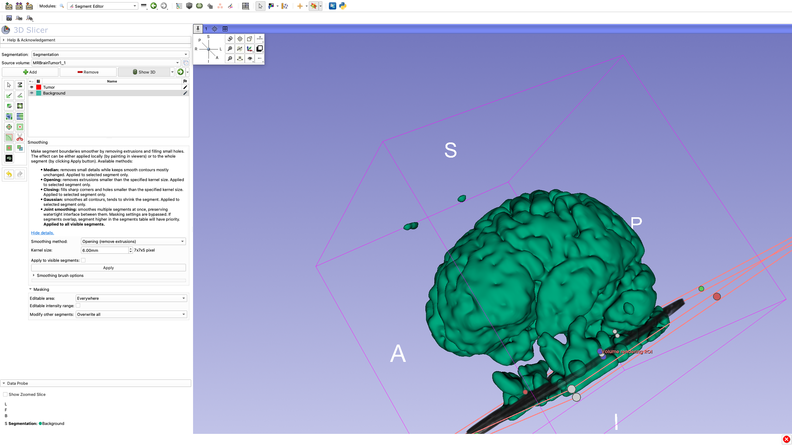 |
| 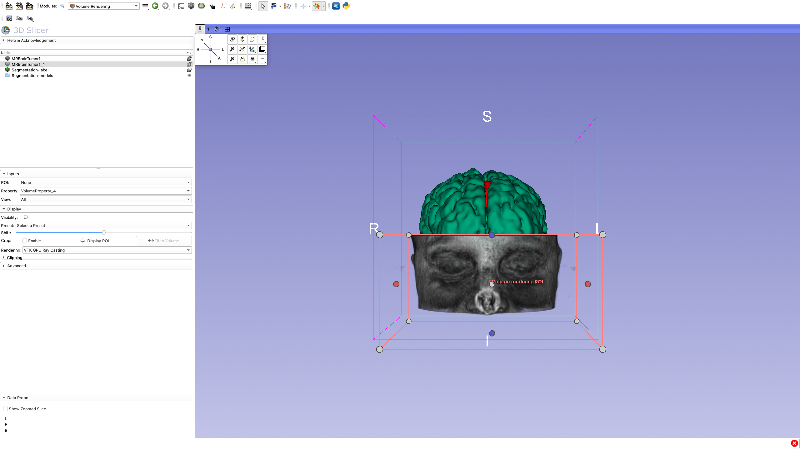 | |

> **Tumor volume: 16.28 cm³** (16,279 mm³ · 13,230 voxels)

---

## Repo layout

```
├── index.html          # portfolio site
├── app.js              # page content
├── viewer.js           # Three.js STL viewers
├── styles.css
├── images/             # README + site screenshots
├── models/             # STL exports (Git LFS)
├── misc/               # original raw screenshots (not used on site)
├── vercel.json
└── README.md
```

---

## Deploy (Vercel)

1. Push to GitHub (enable **Git LFS** for `models/*.stl`).
2. Import repo in [vercel.com](https://vercel.com) — framework preset: **Other** (static).
3. No build command. Output directory: `.` (root).

```bash
git lfs install
git lfs track "*.stl"
```

---

## Local dev

```bash
npm run dev
```

Requires a static server (STL fetch + Babel compile).

---

**Kolade** · [victorkolade.dev](https://victorkolade.dev) · koladeabobarin@gmail.com

Sample data: 3D Slicer public datasets only.
